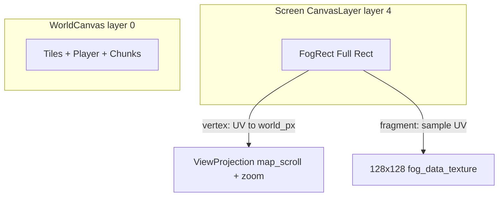

# Fog Viewport Screen Quad

## Goal

Replace the world-space fog quad (under `WorldCanvas/Tiles`) with a **permanent fullscreen screen quad** on a `CanvasLayer`. The shader reconstructs map-local `world_px` per pixel from screen UV + `camera_center_px` / `zoom` (same math as [`GridOverlay.gdshader`](src/Godot/Shaders/GridOverlay.gdshader) `fragcoord_to_map_local`). The 128×128 data texture still recenters on grid thresholds only.

## Architecture



## Self-correction

| Trap | Mitigation |
|------|------------|
| User fragment uses `texture.r` directly | Keep `1.0 - texture.r` (revealed = white in R8 mask) |
| Per-frame GDScript resize | **None** — anchors PRESET_FULL_RECT only |
| `global_position` on world coords | **Removed** — screen quad never moves |
| Hardcoded `64.0` | `ViewMetricsRes.CELL_SIZE_PX` in GDScript `cell_size_px` uniform |
| Camera uniforms stale on zoom | `sync_view_transform` already called from `MainSandbox` on scroll/zoom — push uniforms there |

## File changes

### 1. [`src/Godot/Scenes/FogOverlay.tscn`](src/Godot/Scenes/FogOverlay.tscn)

- Root: `CanvasLayer` named `FogOverlay` (script attached here)
- `follow_viewport_enabled = true`, `layer = 4` (above world, below `GameEntitiesLayer` 16)
- Child `FogRect`: anchors preset 15 (full rect), grow both, transparent color

### 2. [`src/Godot/Scenes/MainSandbox.tscn`](src/Godot/Scenes/MainSandbox.tscn)

- Remove `FogOverlay` from `WorldCanvas/Tiles`
- Add `FogOverlay` instance as child of `MainSandbox` root (after `GridOverlay`)

### 3. [`src/Godot/Scripts/Systems/fog-of-war/FogOverlay.gd`](src/Godot/Scripts/Systems/fog-of-war/FogOverlay.gd)

- `extends CanvasLayer`
- `_ready`: full-rect anchors on `_fog_rect`; remove `z_index` / `z_as_relative`
- **Delete** `_sync_fog_quad_layout()`
- **Add** `_sync_buffer_center_shader()` — only `world_buffer_center_px`
- **Add** `_sync_camera_shader_uniforms(camera_center, zoom)` — `camera_center_px`, `zoom`
- `sync_view_transform`: call camera sync every time; keep buffer recenter logic
- `_recenter_buffer`: `_sync_buffer_center_shader()` only (no rect layout)
- `setup`: `_sync_buffer_center_shader()` instead of layout sync

### 4. [`src/Godot/Shaders/FogOverlay.gdshader`](src/Godot/Shaders/FogOverlay.gdshader)

```glsl
uniform vec2 camera_center_px;
uniform float zoom = 1.0;
// remove fog_quad_origin_map_px

void vertex() {
    vec2 screen_offset_from_center_px = (UV - vec2(0.5)) * rect_size;
    float safe_zoom = max(zoom, 0.0001);
    world_px = camera_center_px + (screen_offset_from_center_px / safe_zoom);
}
```

Fragment unchanged except drop `fog_quad_origin_map_px` dependency; keep `1.0 - texture(...).r`.

### 5. [`src/Godot/Scripts/MainSandbox.gd`](src/Godot/Scripts/MainSandbox.gd)

```gdscript
@onready var _fog_overlay: FogOverlayScript = $FogOverlay
```

### 6. [`src/Godot/Scripts/Systems/fog-of-war/FogExplorationMap.gd`](src/Godot/Scripts/Systems/fog-of-war/FogExplorationMap.gd)

- Type hint `_fog_overlay: CanvasLayer` and `setup(..., fog_overlay: CanvasLayer)`

## Test plan

1. Zoom out fully — no gaps at screen edges (fog covers entire viewport).
2. Pan at min zoom — fog scrolls correctly with world; no jitter at large coordinates.
3. Walk across buffer recenter margin — explored areas restore; unrevealed stays fogged.
4. Toggle fog off/on via settings — visibility still works.

## Execution note

Implementation was prepared but blocked by **Plan mode**. Approve this plan or switch to **Agent mode** to apply the edits.
