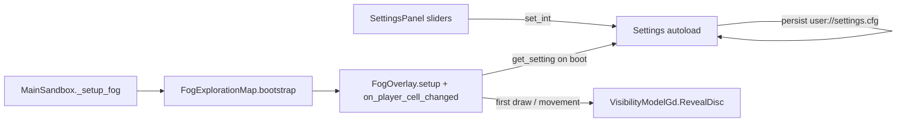

# Settings Panel + Fog Boot Binding

## Scope

| File | Role |
|------|------|
| [`src/Godot/Scenes/SettingsPanel.tscn`](src/Godot/Scenes/SettingsPanel.tscn) | 2× panel scale, fog sliders, footnote |
| [`src/Godot/Scripts/SettingsPanel.gd`](src/Godot/Scripts/SettingsPanel.gd) | Slider UI → Settings |
| [`src/Godot/Config/game_settings.json`](src/Godot/Config/game_settings.json) | Schema for fog radii |
| [`src/Godot/Scripts/Settings.gd`](src/Godot/Scripts/Settings.gd) | Canonical keys, `get_setting()`, persistence |
| [`src/Godot/Scripts/Systems/fog-of-war/FogOverlay.gd`](src/Godot/Scripts/Systems/fog-of-war/FogOverlay.gd) | Boot-time Core `RevealDisc` binding |

Boot path (unchanged orchestration):

`MainSandbox._setup_fog()` → `FogExplorationMap.bootstrap_exploration(spawn_cell)` → `FogOverlay.setup(_visibility, start_cell)` + `on_player_cell_changed(start_cell)`.

---

## 5. Configuration keys + Settings backend (new)

### Canonical schema paths

Rename / consolidate fog radius keys in [`game_settings.json`](src/Godot/Config/game_settings.json) under the `fog` section:

| User-facing name | Schema path | Default | Range |
|------------------|-------------|---------|-------|
| Initial Reveal Radius | `fog.initial_reveal_radius` | **8** | 4–16 |
| Player Reveal Radius | `fog.player_reveal_radius` | **3** | 1–6 |

Both entries: `"step": 1`, `"persist": true`, `"context": "game"`.

**Legacy migration:** On load in [`Settings.gd`](src/Godot/Scripts/Settings.gd), if user cfg still has `fog.initial_reveal_radius_cells` / `fog.movement_reveal_radius_cells`, copy into the new paths once (then save). Remove or mark old keys as deprecated in JSON comments.

### Settings.gd API

Add generic accessor (maps user’s `SettingsManager.get_setting` intent to the existing `Settings` autoload):

```gdscript
func get_setting(path: String, default_value: Variant = null) -> Variant:
	if not has(path):
		return default_value
	match _schema[path].get("type", TYPE_NIL):
		TYPE_BOOL: return get_bool(path)
		TYPE_INT: return get_int(path)
		_: return get_float(path)
```

Add convenience properties (hot paths for fog boot):

```gdscript
var initial_reveal_radius: int:
	get: return get_int("fog.initial_reveal_radius")
	set(v): set_int("fog.initial_reveal_radius", v)

var player_reveal_radius: int:
	get: return get_int("fog.player_reveal_radius")
	set(v): set_int("fog.player_reveal_radius", v)
```

Add `FOG_PATHS` array (like `MOVEMENT_PATHS`) and emit optional `fog_changed` signal from `_set_value` when those paths change (for future live UI sync; boot still reads at `setup()` only).

Update [`SettingsPanel.gd`](src/Godot/Scripts/SettingsPanel.gd) sliders to use **`fog.initial_reveal_radius`** and **`fog.player_reveal_radius`** (not `*_cells`).

---

## 6. FogOverlay boot binding (new)

### Rename flag

Rename `_is_first_reveal` → **`_is_first_draw`** (matches user spec; set `true` in `setup()`, cleared after first successful reveal).

### Load radii on boot

In `setup()` and `_read_fog_settings()`, replace `_read_int_setting("fog.initial_reveal_radius_cells", …)` with:

```gdscript
const PATH_INITIAL := "fog.initial_reveal_radius"
const PATH_PLAYER := "fog.player_reveal_radius"

_initial_reveal_radius = int(Settings.get_setting(PATH_INITIAL, 8))
_player_reveal_radius = int(Settings.get_setting(PATH_PLAYER, 3))
```

Update defaults: `DEFAULT_INITIAL_REVEAL_RADIUS = 8`, `DEFAULT_MOVEMENT_REVEAL_RADIUS` → rename field to `_player_reveal_radius`.

### Frame-one reveal in `on_player_cell_changed`

Adapt user pseudocode to **actual project wiring** (no direct `CoreBridge.VisibilityModel` — use injected `_visibility` from `FogExplorationMap`):

```gdscript
func on_player_cell_changed(cell: Vector2i) -> void:
	if not _configured or _visibility == null:
		return
	if cell == _last_reveal_cell:
		return

	_read_fog_settings()  # reload radii each boot call; cheap int read
	var radius: int = _initial_reveal_radius if _is_first_draw else _player_reveal_radius

	if _is_first_draw:
		_is_first_draw = false

	_last_reveal_cell = cell

	if _needs_recenter(cell):
		_recenter_buffer(cell, radius)
	else:
		reveal_cells_at(cell, radius)  # _visibility.RevealDisc + buffer stamp
		_fog_texture.update(_fog_image)
```

`reveal_cells_at()` already calls `_visibility.RevealDisc(grid_coord.x, grid_coord.y, radius_cells)` — that **is** the Core write path.

### Optional: sync Core model metadata

In [`FogExplorationMap.gd`](src/Godot/Scripts/Systems/fog-of-war/FogExplorationMap.gd) `setup()`, after `CreateVisibilityModel()`, set `InitialRevealRadius` / `MovementRevealRadius` on the wrapper from `Settings.initial_reveal_radius` / `Settings.player_reveal_radius` so any other Core consumers stay aligned. Small additive change; not required if all reveals go through `FogOverlay`.

---

## 1–4. Settings panel UI (unchanged intent, updated keys)

### 1. Double panel scale (2×)

Same as before: `SettingsPanelRoot` min width 220→**440**, `TopRightVBox.offset_left` -236→**-456**, double margins/separations/slider mins, fonts 13→**26** and 10→**20**, double compact slider theme margins, `hud_theme.default_font_size = Settings.get_int("hud.font_size") * 2`.

### 2–4. Fog sliders + footnote

Fog block labels (exact):

- `Initial Reveal Radius *`
- `Player Reveal Radius *`

Footnote (exact): `* Requires a brand new game session to take effect.`

Sliders bind to **`fog.initial_reveal_radius`** / **`fog.player_reveal_radius`** with defaults **8** / **3**.

---

## Data flow (end-to-end)



---

## Self-correction (performance)

- **Trap:** Re-reading settings every cell change — only needed if hot-reload mid-session; for boot binding, load once in `setup()` and optionally skip `_read_fog_settings()` inside `on_player_cell_changed` (read only in `setup()` / `_ready`).
- **Trap:** Double `RevealDisc` on bootstrap — `bootstrap_exploration` calls `on_player_cell_changed(start_cell)` once; ensure `_is_first_draw` is still true so spawn gets **initial** radius only once.

---

## Verification

1. UI: 2× panel, sliders 8 and 3 by default, clamps 4–16 / 1–6, footnote visible.
2. Set initial to 12 in UI, restart game: spawn exploration disc radius ≈ 12 cells in Core (check via revealed area / debug).
3. Move to new cell: expansion uses **player** radius (e.g. 3), not initial.
4. Mid-session slider change does not reshape existing fog until new boot (footnote behavior).
