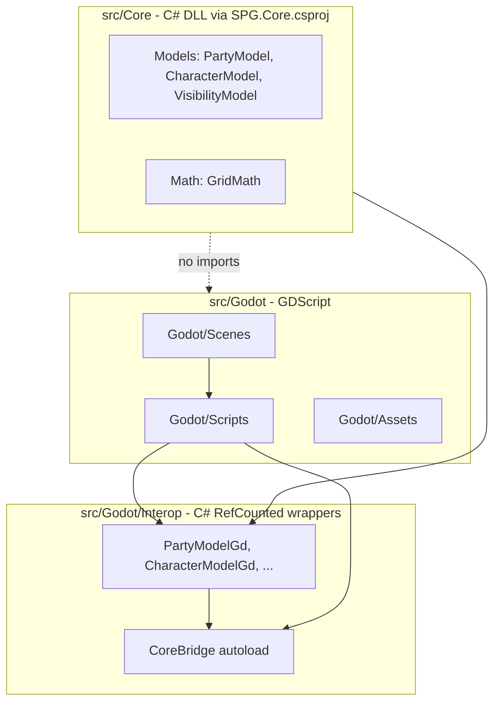

# Architecture: Core vs Godot

## Dependency direction

- **One-way only:** `src/Godot/` may depend on `src/Core/`. `src/Core/` must never import or reference `res://src/Godot/`.
- **Core is C#:** `src/Core/` (Models, Systems) built by [`src/SPG.Core.csproj`](../src/SPG.Core.csproj) — plain `net6.0` class library, no Godot references. GDScript must **not** `preload` Core paths.
- **Interop bridge:** GDScript talks to Core only through `src/Godot/Interop/` C# wrappers and the **`CoreBridge`** autoload (`/root/CoreBridge`). Use **PascalCase** when calling C# from GDScript (e.g. `CoreBridge.CreatePartyModel()`, `character.MoveRelative()`).
- **World streaming:** Infinite terrain is handled in GDScript by `ChunkManager` (`src/Godot/Scripts/World/`). Query tiles via `get_tile_type_at_global_pos()` / `get_tile_type_at_grid()` — not Core `GridModel`.
- **GDScript performance:** For chunk streaming, procedural generation, fog, or other hot-path systems, follow [godot-performance.mdc](godot-performance.mdc). Plans and PRs must include a **Self-Correction Step** (traps + bypasses) before implementation.
- Do **not** place `.gdignore` on `src/Core/` if Godot needs to see the folder for project layout; Core logic lives in `.cs` files compiled via `SPG.sln`.

## Layer flow

## Rendering & Layer Hierarchy Constraints

To preserve visual consistency, performance, and coordinate mapping stability, the scene tree layout must strictly respect the following bottom-to-top rendering layer stack:

1. **Ground/Map Layer (TileMaps)** — Base terrain, grass, obstacles, and world layout (`WorldCanvas/Tiles/ChunkManager` and tile content).
2. **Entity Layer (Node2D)** — Player characters, enemies, units, and interactive world objects (siblings under `WorldCanvas/Tiles`, e.g. `Player`).
3. **Fog of War Layer (CanvasItem/Shader)** — Screen-space fullscreen quad on a `CanvasLayer` (`FogOverlay` → `FogRect` + `FogOverlay.gdshader`). Shader projects canvas px to map-local via `ViewProjection` uniforms; buffer data stays map-local px.
4. **Heads-Up Display / HUD Layer (CanvasLayer)** — Screen-space user interfaces, health bars, menus, and control widgets (`GridOverlay`, `SettingsUi`, `GameEntitiesLayer` for entity chrome that must stay screen-aligned).

Fog buffer uniforms (`world_buffer_origin_px`, `cell_size_px`) use map-local pixels aligned with `ViewProjection.map_scroll`. The fog quad is screen-space; it does not live under `_map_scroll`.

### Architectural Rules for the Fog of War System

- **No Invisible State Traps:** The Fog of War system must never use fallback logic that sets alpha transparency to `0.0` for out-of-bounds calculations. Any coordinate outside our active tracking window must default strictly to an opaque `alpha_mask = 1.0` (solid unrevealed black fog).
- **Screen-Space Presentation:** Fog renders on a fullscreen `CanvasLayer` (`layer = 4`). The shader reconstructs map-local `world_px` from `FRAGCOORD`, `viewport_center_px`, `camera_focus_map_px`, and `zoom` (same projection as `GridOverlay.gdshader`).
- **Reveal Mask Convention:** R8 fog data uses white = revealed, black = fogged; shader output uses `1.0 - texture(...).r` so revealed areas become transparent and unrevealed areas stay opaque.
- **Implementation note:** In GDScript use `ViewMetrics.CELL_SIZE_PX` instead of a literal `64.0`. Buffer center is `grid * CELL_SIZE_PX` in map-local px; no manual zoom on placement coordinates.

### FOG OF WAR MATHEMATICAL CONTRACT

- The `FogOverlay` root is a `CanvasLayer` with a fullscreen `FogRect` child (anchors full rect; no per-frame GDScript sizing).
- The shader reconstructs map-local coordinates per fragment:
  `vec2 world_px = (FRAGCOORD - viewport_center_px) / zoom + camera_focus_map_px;`
- Sample the sliding buffer relative to `world_buffer_origin_px` and `buffer_size_cells * cell_size_px`.
- The out-of-bounds fallback inside the fragment shader must remain strictly `alpha_mask = 1.0`.

### SYSTEM ARCHITECTURE DIRECTIVE: Fog of War System

1. **Scene Tree Hierarchy:** `FogOverlay` is a sibling of `GridOverlay` under `MainSandbox` root — screen-space, above world content (`layer = 4`).
2. **Transform Constancy:** `FogRect` never moves; camera scroll/zoom are shader uniforms updated from `MainSandbox._sync_fog_view_transform`. Buffer recenters on grid thresholds only.
3. **Shader Coordinate Mapping:** Map-local px from screen projection; buffer UV from offset against `world_buffer_origin_px`.
4. **Boundary Failure Guard:** The out-of-bounds fallback code block inside the shader must return an alpha mask value of `1.0` (opaque black fog) under all conditions. It must never fall back to `0.0`.

### FOG & VIEW CONVERSIONS (Frame-Zero)

1. **Never Assume Frame-Zero Core Data is Ready:** On the very first frame, the active player node may not yet have updated the global `ViewProjection` singleton with its true position. Querying `ViewProjection.map_scroll` at startup can return `(0,0)` even when the player scene node already has a valid map-local position.
2. **Dynamic Fallback Target:** When resolving fog or overlay camera focus, use `ViewProjection.resolve_camera_focus_map_px(fallback_player)` — player node position first, then `map_scroll`, then Settings spawn (`world.spawn_safe_zone_x/y`). `(0,0)` is a **valid** coordinate; never use `!= Vector2.ZERO` as a readiness test.
3. **Input Wakes Stale Caches:** WASD movement must mark the view dirty (force sync) so `ViewProjection` and `FogOverlay` recenter on the next flush. Sub-cell motion must not rely solely on grid-cell boundary signals.
