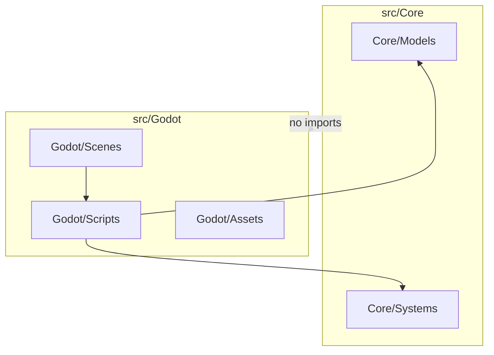

# Architecture: Core vs Godot

## Dependency direction

- **One-way only:** `src/Godot/` may depend on `src/Core/`. `src/Core/` must never import or reference `res://src/Godot/`.
- Godot-layer scripts may `preload` or `load` Core scripts via `res://src/Core/...`.
- Do **not** place `.gdignore` on `src/Core/` — that blocks the Godot layer from loading Core scripts.

## Layer flow

## Enforced by convention (this phase) and by code shape (later)

### `src/Core/`

| Allowed in `src/Core/` | Forbidden in `src/Core/` |
| :--- | :--- |
| `extends RefCounted` (or plain classes with no engine base) | `extends Node`, `Node2D`, `Control`, `Resource`, `TileMap`, etc. |
| Plain data: dictionaries, arrays, enums, typed properties | `@onready`, `%Node`, scene paths |
| Pure functions: movement validation, turn order, stat math | `get_tree()`, `Input`, `RenderingServer`, signals tied to nodes |
| Unit-testable state machines | `preload("*.tscn")`, `.tres` that are Godot resources |
| Pure native language types (`int`, `float`, `String`, standard Arrays) | **Godot math/engine structures (`Vector2`, `Vector3`, `Transform2D`, `Color`). Core coordinates must use custom plain objects or simple `x: int` and `y: int` pairs.** |

### `src/Godot/`

| Allowed in `src/Godot/` | Responsibility |
| :--- | :--- |
| Scenes, nodes, TileMaps, animations | Presentation and input |
| Thin **adapter** scripts | Copy Core state in/out; never duplicate rules in the view layer |
| `class_name` prefixed e.g. `RiftsGodot_*` (future) | Clear grep boundary vs `RiftsCore_*` in Core |

**View metric scale (canonical):** `src/Godot/Scripts/ObliqueBridge.gd` is the single source of truth for screen-space world units. **32 pixels = 1 meter.** One logical Core grid cell = **2 meters** = **64 pixels** (`CELL_SIZE_PX`). All grid-to-screen, meter-to-pixel, and speed conversions must go through `ObliqueBridge`—do not hardcode `32` or `64` for positioning elsewhere in the Godot layer.

## Naming convention (future)

- Core: `class_name` prefix `RiftsCore_*`
- Godot: `class_name` prefix `RiftsGodot_*`
