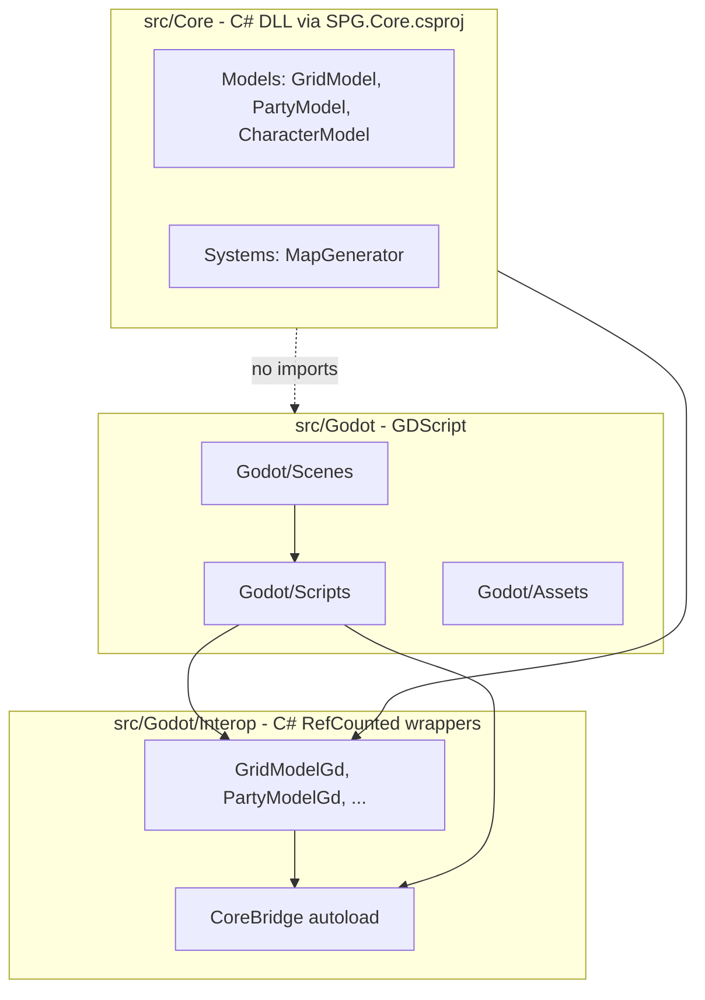

# Architecture: Core vs Godot

## Dependency direction

- **One-way only:** `src/Godot/` may depend on `src/Core/`. `src/Core/` must never import or reference `res://src/Godot/`.
- **Core is C#:** `src/Core/` (Models, Systems) built by [`src/SPG.Core.csproj`](../src/SPG.Core.csproj) — plain `net6.0` class library, no Godot references. GDScript must **not** `preload` Core paths.
- **Interop bridge:** GDScript talks to Core only through `src/Godot/Interop/` C# wrappers and the **`CoreBridge`** autoload (`/root/CoreBridge`). Use **PascalCase** when calling C# from GDScript (e.g. `CoreBridge.CreateGridModel()`, `grid.GetCellPrimary()`).
- Do **not** place `.gdignore` on `src/Core/` if Godot needs to see the folder for project layout; Core logic lives in `.cs` files compiled via `SPG.sln`.

## Layer flow

## Enforced by convention (this phase) and by code shape (later)

### `src/Core/` (namespace `SPG.Core`)

| Allowed in Core | Forbidden in Core |
| :--- | :--- |
| Plain .NET types: `int`, `float`, `string`, `Dictionary`, enums | Godot types, `GodotSharp`, `Vector2`, nodes, resources |
| Pure functions: movement, map generation, stat math | `get_tree()`, `Input`, scene paths |
| Pure state machines (no engine deps) | Any `res://` or engine API |

### `src/Godot/Interop/`

| Allowed | Responsibility |
| :--- | :--- |
| `Godot.RefCounted` wrappers holding Core instances | Expose PascalCase methods/properties to GDScript (`GetCellPrimary`, `X`, `Y`, etc.) |
| `CoreBridge` autoload (`Node`) | Factory methods only; no gameplay rules |

### `src/Godot/` (GDScript)

| Allowed in `src/Godot/` | Responsibility |
| :--- | :--- |
| Scenes, nodes, TileMaps, animations | Presentation and input |
| Thin **adapter** scripts | Call Interop wrappers; never duplicate rules in the view layer |
| `class_name` prefixed e.g. `RiftsGodot_*` (future) | Clear grep boundary vs Core types |

**View metric scale (canonical):** `ViewMetrics.gd` / `ViewTransforms.gd` own pixel and canvas conversions. **32 pixels = 1 meter.** One logical Core grid cell = **2 meters** = **64 pixels** (`CELL_SIZE_PX`). `METERS_PER_CELL` must match `SPG.Core.GridMath.MetersPerCell`. All grid-to-screen, meter-to-pixel, and speed conversions must go through `ViewTransforms` (or `ObliqueBridge` facade)—do not hardcode `32` or `64` for positioning elsewhere in the Godot layer.

## Coordinate spaces

| Space | Owner | Representation | Notes |
| :--- | :--- | :--- | :--- |
| **Grid** | Core (`GridMath`) | integer `(x, y)` cell indices | Game rules, movement, visibility |
| **WorldM** | Core + Godot | continuous meters | Fog, reveal; origin at grid (0,0) corner |
| **MapLocalPx** | Godot (`ViewTransforms`) | unzoomed pixels | Tile/sprite placement before scroll/zoom |
| **Canvas** | Godot | viewport pixels | Mouse, `get_viewport()`, fog shader `FRAGCOORD` |
| **View** | Godot | pixels relative to viewport center | Player-anchored HUD offsets |
| **OverlayLocal** | Godot | CanvasLayer draw space | Grid overlay, debug rings |

- **Core** owns grid-index math and `MetersPerCell` (`src/Core/Math/GridMath.cs`).
- **Godot** owns all pixel/canvas/view transforms (`ViewTransforms.gd`, `ViewContext.gd`).
- **Generic 2D math** (lerp, AABB, angles): `Math2D.gd` — no coordinate-space semantics.
- **Domain fog geometry**: `RevealMath.gd` — uses `ViewTransforms` for world-meter positions.
- Prefer `ViewTransforms.grid_to_map_local_px` over legacy `ObliqueBridge.data_to_screen` in new code.
- GDScript may read Core grid rules via `GridMathGd` / `CoreBridge.CreateGridMath()` when crossing layers (not per-frame hot paths).

## Naming convention (future)

- Core: namespace `SPG.Core`, types without Godot suffix
- Interop: `*Gd` suffix on wrappers (`GridModelGd`)
- Godot GDScript: `class_name` prefix `RiftsGodot_*` (future)

## Build requirements

- **Godot 4.3 .NET (mono)** editor — project `config/features` includes `"C#"`.
- **.NET SDK** 6+ for `dotnet build SPG.sln`.
- Pin CLI to **4.3-mono** (e.g. gdvm) so editor and `godot_console` match.
