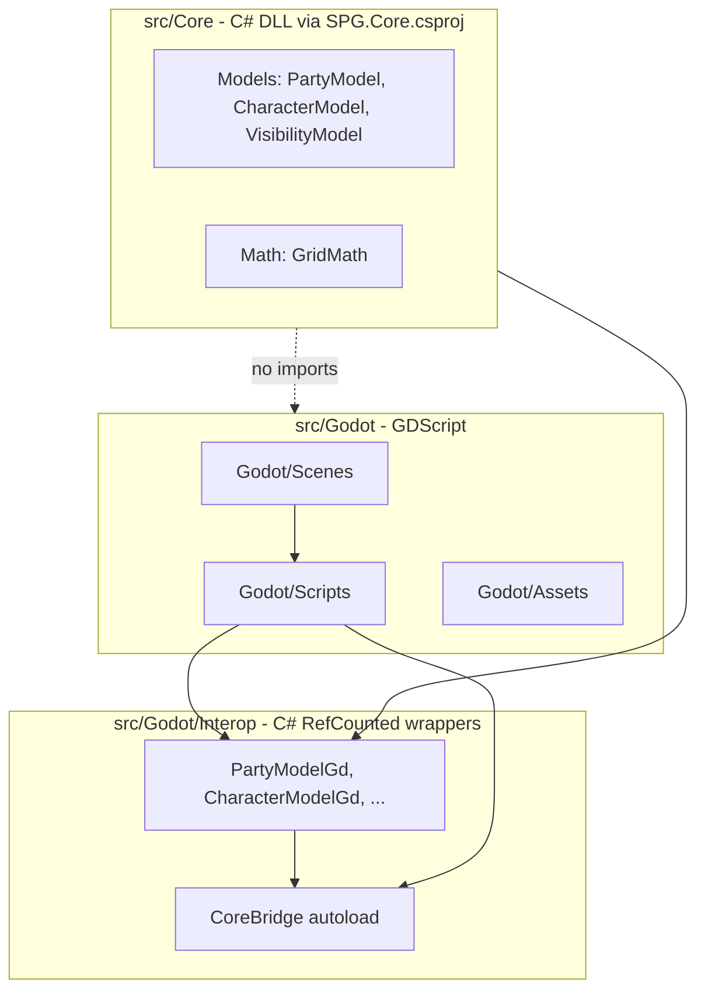

# Architecture: Core vs Godot

## Dependency direction

- **One-way only:** `src/Godot/` may depend on `src/Core/`. `src/Core/` must never import or reference `res://src/Godot/`.
- **Core is C#:** `src/Core/` (Models, Systems) built by [`src/SPG.Core.csproj`](../src/SPG.Core.csproj) — plain `net6.0` class library, no Godot references. GDScript must **not** `preload` Core paths.
- **Interop bridge:** GDScript talks to Core only through `src/Godot/Interop/` C# wrappers and the **`CoreBridge`** autoload (`/root/CoreBridge`). Use **PascalCase** when calling C# from GDScript (e.g. `CoreBridge.CreatePartyModel()`, `character.MoveRelative()`).
- **World streaming:** Infinite terrain is handled in GDScript by `ChunkManager` (`src/Godot/Scripts/World/`). Query tiles via `get_tile_type_at_global_pos()` / `get_tile_type_at_grid()` — not Core `GridModel`.
- **GDScript performance:** For chunk streaming, procedural generation, fog, or other hot-path systems, follow [godot-performance.mdc](godot-performance.mdc). Plans and PRs must include a **Self-Correction Step** (traps + bypasses) before implementation.
- Do **not** place `.gdignore` on `src/Core/` if Godot needs to see the folder for project layout; Core logic lives in `.cs` files compiled via `SPG.sln`.

## Layer flow

## Rendering & Layer Hierarchy Constraints

To preserve visual consistency, performance, and coordinate mapping stability, the scene tree layout must strictly respect the following bottom-to-top rendering layer stack:

1. **Ground/Map Layer (TileMaps)** — Base terrain, grass, obstacles, and world layout (`WorldCanvas/Tiles/ChunkManager` and tile content).
2. **Entity Layer (Node2D)** — Player characters, enemies, units, and interactive world objects (siblings under `WorldCanvas/Tiles`, e.g. `Player`).
3. **Fog of War Layer (CanvasItem/Shader)** — Must render directly **over** the terrain and game entities, obscuring them completely unless revealed by tracking coordinates (`WorldCanvas/Tiles/FogOverlay` → map-local `FogRect` + `FogOverlay.gdshader`).
4. **Heads-Up Display / HUD Layer (CanvasLayer)** — Screen-space user interfaces, health bars, menus, and control widgets (`GridOverlay`, `SettingsUi`, `GameEntitiesLayer` for entity chrome that must stay screen-aligned).

Do **not** parent fog under a screen `CanvasLayer` if buffer uniforms use map-local pixels. Fog and `world_buffer_center_px` must share the same coordinate space as `ViewProjection.map_scroll`.

### Architectural Rules for the Fog of War System

- **No Invisible State Traps:** The Fog of War system must never use fallback logic that sets alpha transparency to `0.0` for out-of-bounds calculations. Any coordinate outside our active tracking window must default strictly to an opaque `alpha_mask = 1.0` (solid unrevealed black fog).
- **Blanket Size Limits:** Never size fog `Control` nodes to hardcoded extremes (e.g. 32,768 px). Compute map-local footprint as `(viewport_size / zoom) * 1.5` and apply it via `.scale`, not `.size`.
- **Reveal Mask Convention:** R8 fog data uses white = revealed, black = fogged; shader output uses `1.0 - texture(...).r` so revealed areas become transparent and unrevealed areas stay opaque.
- **Implementation note:** In GDScript use `ViewMetrics.CELL_SIZE_PX` instead of a literal `64.0`. Under `WorldCanvas/Tiles` (`_map_scroll`), set map-local `FogRect.position` (not `global_position`) and pass the same vector to `world_blanket_origin_px`.

### FOG OF WAR MATHEMATICAL CONTRACT

- The `FogRect` (`ColorRect`) node must live as a child of `_map_scroll` (`WorldCanvas/Tiles`).
- In `_process()`, its base size MUST be strictly locked to `Vector2(1, 1)`.
- Visual viewport scaling must be applied exclusively via its `.scale` property (`world_view_size = (vp_size / zoom) * 1.5`).
- The shader MUST reconstruct world coordinates linearly using:
  `vec2 world_px = world_blanket_origin_px + (UV * world_blanket_size_px);`
- Pass `world_blanket_origin_px` = map-local `FogRect.position` (top-left of the blanket in map px) and `world_blanket_size_px` = `world_view_size` (logical map footprint, not screen px).
- The out-of-bounds fallback inside the fragment shader must remain strictly `alpha_mask = 1.0`.

### SYSTEM ARCHITECTURE DIRECTIVE: Fog of War System

1. **Scene Tree Hierarchy:** The `FogOverlay` node must live as a child of the moving world container (`_map_scroll`). It must render after the terrain tiles and before player HUD/UI elements.
2. **Transform Constancy:** The `FogRect` child must stay centered over the buffer tracking center in map-local pixels. Layout runs only in `_process()`; `_recenter_buffer()` updates buffer uniforms and textures only.
   - `_process()`: `FogRect.size = Vector2.ONE`, `FogRect.scale = world_view_size`, `FogRect.position = buffer_center_px - world_view_size * 0.5`
3. **Shader Coordinate Mapping:** Reconstruct absolute map-local coordinates from explicit blanket uniforms (not vertex transforms):
   - `vec2 world_px = world_blanket_origin_px + (UV * world_blanket_size_px);`
4. **Boundary Failure Guard:** The out-of-bounds fallback code block inside the shader must return an alpha mask value of `1.0` (opaque black fog) under all conditions. It must never fall back to `0.0`.
