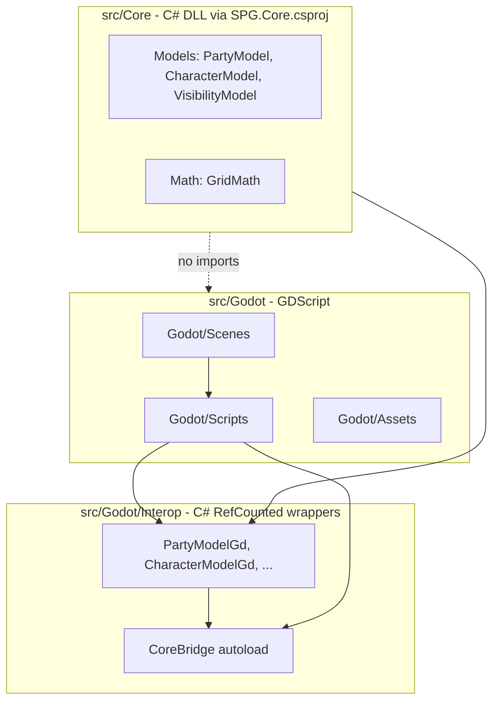

# Architecture: Core vs Godot

## Dependency direction

- **One-way only:** `src/Godot/` may depend on `src/Core/`. `src/Core/` must never import or reference `res://src/Godot/`.
- **Core is C#:** `src/Core/` (Models, Systems) built by [`src/SPG.Core.csproj`](../src/SPG.Core.csproj) — plain `net6.0` class library, no Godot references. GDScript must **not** `preload` Core paths.
- **Interop bridge:** GDScript talks to Core only through `src/Godot/Interop/` C# wrappers and the **`CoreBridge`** autoload (`/root/CoreBridge`). Use **PascalCase** when calling C# from GDScript (e.g. `CoreBridge.CreatePartyModel()`, `character.MoveRelative()`).
- **World streaming:** Infinite terrain is handled in GDScript by `ChunkManager` (`src/Godot/Scripts/World/`). Query tiles via `get_tile_type_at_global_pos()` / `get_tile_type_at_grid()` — not Core `GridModel`.
- **GDScript performance:** For chunk streaming, procedural generation, fog, or other hot-path systems, follow [godot-performance.mdc](godot-performance.mdc). Plans and PRs must include a **Self-Correction Step** (traps + bypasses) before implementation.
- Do **not** place `.gdignore` on `src/Core/` if Godot needs to see the folder for project layout; Core logic lives in `.cs` files compiled via `SPG.sln`.

## Layer flow

