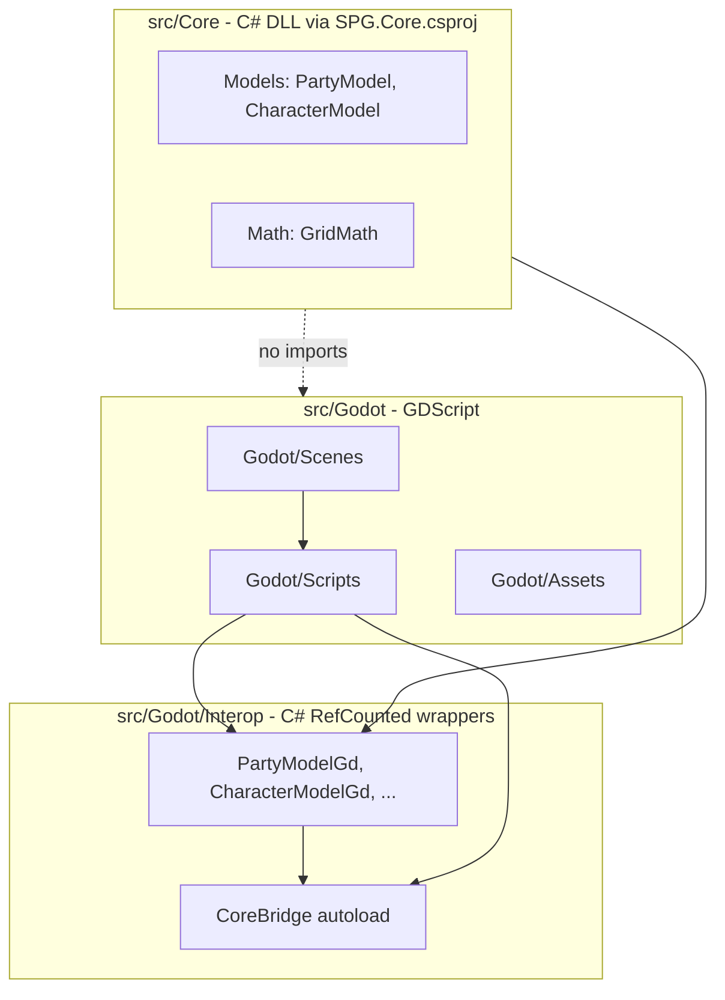

# Architecture: Core vs Godot

## Dependency direction

- **One-way only:** `src/Godot/` may depend on `src/Core/`. `src/Core/` must never import or reference `res://src/Godot/`.
- **Core is C#:** `src/Core/` (Models, Systems) built by [`src/SPG.Core.csproj`](../src/SPG.Core.csproj) — plain `net6.0` class library, no Godot references. GDScript must **not** `preload` Core paths.
- **Interop bridge:** GDScript talks to Core only through `src/Godot/Interop/` C# wrappers and the **`CoreBridge`** autoload (`/root/CoreBridge`). Use **PascalCase** when calling C# from GDScript (e.g. `CoreBridge.CreatePartyModel()`, `character.MoveRelative()`).
- **Caller-owned buffers:** `PackedByteArray` → C# `byte[]` is a **copy**; `*Into(..., buffer)` does not update GDScript memory. Use `*Native` methods that **return** `byte[]` and assign with `PackedByteArray(...)`. See [`src/Godot/Interop/INTEROP.md`](../src/Godot/Interop/INTEROP.md).
- **World streaming:** Infinite terrain is handled in GDScript by `ChunkManager` (`src/Godot/Scripts/World/`). Query tiles via `get_tile_type_at_global_pos()` / `get_tile_type_at_grid()` — not Core `GridModel`.
- **Coding safety:** Every implementation task follows [coding-safety.mdc](coding-safety.mdc) (STOP before edit, Self-Correction in chat with perf implications, preserve working code).
- **GDScript performance:** For chunk streaming, procedural generation, or other hot-path systems, follow [godot-performance.mdc](godot-performance.mdc). The Self-Correction Step must include holistic pipeline traps + bypasses before implementation.
- **Holistic, not patchwork:** Performance fixes must redesign the **pipeline** (hot path vs cold path, single budgeted tick, queued work, merged GPU commits) — not accumulate one-off skips or constant tweaks. If a system has multiple entry points that each do heavy work, unify them before optimizing the kernel.
- Do **not** place `.gdignore` on `src/Core/` if Godot needs to see the folder for project layout; Core logic lives in `.cs` files compiled via `SPG.sln`.

## Layer flow

## Rendering & Layer Hierarchy Constraints

To preserve visual consistency, performance, and coordinate mapping stability, the scene tree layout must strictly respect the following bottom-to-top rendering layer stack:

1. **Ground/Map Layer (TileMaps)** — Base terrain, grass, obstacles, and world layout (`WorldCanvas/Tiles/ChunkManager` and tile content).
2. **Entity Layer (Node2D)** — Player characters, enemies, units, and interactive world objects (siblings under `WorldCanvas/Tiles`, e.g. `Player`).
3. **Debug / HUD Layer (CanvasLayer)** — Screen-space overlays and UI (`GridOverlay`, `SettingsUi`).

### View & overlay conversions (frame-zero)

1. **Never Assume Frame-Zero Core Data is Ready:** On the very first frame, the active player node may not yet have updated the global `ViewProjection` singleton with its true position. Querying `ViewProjection.map_scroll` at startup can return `(0,0)` even when the player scene node already has a valid map-local position.
2. **Dynamic Fallback Target:** When resolving overlay camera focus, use `ViewProjection.resolve_camera_focus_map_px(fallback_player)` — player node position first, then `map_scroll`, then Settings spawn (`world.spawn_safe_zone_x/y`). `(0,0)` is a **valid** coordinate; never use `!= Vector2.ZERO` as a readiness test.
3. **Single View Apply:** `MainSandbox._apply_view_frame()` builds one `ViewFrame` per frame (after `PlayerController` updates `set_camera_focus`) and applies it to terrain scroll and optional `GridOverlay`. No duplicate sync paths.

## Performance architecture (holistic)

Complex Godot presentation systems must match the **ChunkManager pattern**:

| Concern | Pattern |
|--------|---------|
| Work scheduling | Queue + drain under per-frame CPU budget (`*_frame_budget_usec` in `game_settings.json`) |
| Movement / input | Hot path only — shaders and uniforms; no heavy gen/paint on every cell cross |
| Triggers | Enqueue; do not stamp/upload inline from scattered signal handlers |
| GPU uploads | Merge dirty rects; throttle to ≤1 commit/frame when possible |
| Frame order | Presentation tick runs **after** player/movement systems that feed it |
| Interop | Caller-owned buffer; avoid full-buffer marshaling per operation ([`INTEROP.md`](../src/Godot/Interop/INTEROP.md)) |

Before implementing or refactoring a hot-path system, read [godot-performance.mdc](godot-performance.mdc) and document traps + pipeline design in the plan or PR.
